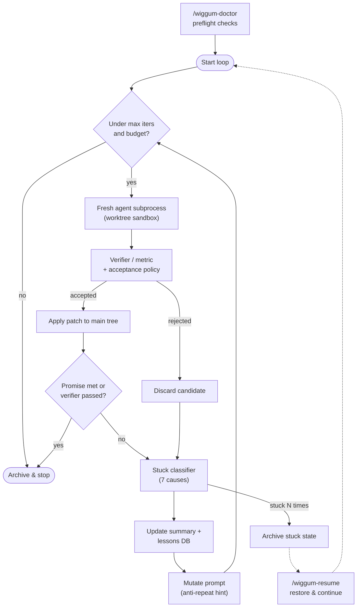

# Wiggum Loop

[](https://github.com/dr-gareth-roberts/chief-wiggum-loop/actions/workflows/ci.yml)
[](LICENSE)
[](pyproject.toml)

**A hardened, sandbox-safe autonomous loop for Claude Code that stops when it stalls instead of spinning forever.**

Wiggum Loop takes an agent task, runs it in a bounded iteration loop, and carries only compact file-based memory between iterations. It classifies *why* a run got stuck, sandboxes candidate edits in a throwaway git worktree, and can resume a stalled run from an archive. It is a zero-dependency, stdlib-only tool that orchestrates Claude Code (or any CLI agent).

## Relationship to Anthropic's Ralph Loop

Wiggum builds directly on **[Anthropic's Ralph Loop](https://github.com/anthropics/claude-code)** concept for Claude Code: repeatedly re-issue the same prompt from a `Stop` hook so the agent keeps working toward a goal across turns. That pattern is excellent for short, interactive self-correction.

The Ralph pattern has one structural weakness on long runs: every iteration accumulates in the same session, so the model can drift, repeat failed attempts, or give up as context grows. Wiggum keeps the Stop-hook mode and adds the hardening that makes unattended long runs safe:

| Concern | Ralph Loop | Wiggum Loop |
|---|---|---|
| Iteration context | Grows in one session | **Fresh subprocess per iteration**, bounded file memory carried forward |
| Termination | Manual / prompt-driven | **Stuck classifier** with seven distinct failure causes; finite by default |
| Blast radius of edits | Edits the live tree | **Worktree sandbox by default** (git repos); only accepted patches touch main |
| Recovery | Restart from scratch | **`/wiggum-resume`** restores the latest stuck archive and continues |
| Preflight | None | **`/wiggum-doctor`** validates env, git, agent CLI, and writable state |
| Learning | None | **Project-only lessons DB** records failure lessons to avoid repeats |

The differentiation is *operational hardening*: it takes the Ralph idea from a clever hook into something you can leave running unattended and reason about afterwards.

## Key features

- **True isolated runner** — every iteration is a fresh agent subprocess; no context bloat.
- **Stuck classifier** — labels each stalled round as one of seven causes (timeout, refusal, no progress, repeated verifier failure, missing metric, policy rejection) and mutates the next prompt to break the loop.
- **Worktree sandboxing** — candidate patches run in a temporary git worktree; rejected candidates are discarded automatically and never touch the main tree.
- **Best-of-N candidates** — run N workers per iteration and keep only the best accepted patch, ranked by verifier → metric → patch size.
- **Preflight doctor** (`/wiggum-doctor`) and **resume** (`/wiggum-resume`) for safe, recoverable long runs.
- **Bounded memory + lessons DB** — a rolling summary and a project-local lessons file prevent repeated failed attempts.
- **Budgets, presets, critic/reviewer models, dashboards, and desktop notifications** for unattended operation.
- **Zero runtime dependencies** — pure Python stdlib, works on Python 3.9+.

## Architecture

The loop lifecycle: preflight validation, then bounded iteration where each round runs a fresh sandboxed agent, is checked by a verifier, and is classified if it stalls. Stuck runs are archived (and resumable); lessons feed forward.



## Quickstart (verified, no API key required)

Everything below runs standalone in this sandbox. No API key or Claude CLI is needed for the verification path — the loop orchestrates *any* command, so the quickstart uses a trivial echo "agent".

### 1. Preflight check

```bash
git clone https://github.com/dr-gareth-roberts/chief-wiggum-loop.git
cd chief-wiggum-loop
chmod +x hooks/*.sh hooks/wiggum_stop_hook.py scripts/*.sh tests/*.sh
./scripts/wiggum-doctor.sh
```

Expected output (warnings for unset env vars are normal):

```text
✅ python: 3.x at /usr/bin/python3
✅ git repo: ... is a git work tree
✅ git HEAD: ...
✅ ~/.wiggum writable: ...
⚠️ env WIGGUM_AGENT_COMMAND: unset (default fallbacks will be used)
...
✅ active loop state: none
✅ stuck archives: none

Summary: 12 checks, 0 failed, 5 warnings
```

### 2. Run the isolated loop offline

Point the runner at a trivial "agent" that emits the completion promise. This proves the full lifecycle — fresh subprocess, acceptance, promise detection, archival — without any model:

```bash
cd /tmp && mkdir wiggum-demo && cd wiggum-demo && git init -q && git commit -q --allow-empty -m init
/path/to/chief-wiggum-loop/scripts/wiggum-isolated-loop.sh \
  "Print the completion promise." \
  --agent-command "printf '<promise>DEMO-DONE</promise>'" \
  --completion-promise "DEMO-DONE" \
  --max-iterations 3 \
  --sandbox none \
  --prompt-mutation none
```

Expected output:

```text
🔁 Wiggum isolated loop starting: mode=reflective, agents=["printf '<promise>DEMO-DONE</promise>'"], candidates=1
↻ isolated iteration 1: accepted=True candidate=1 exit=0 verifier=None metric=None stagnant=1 reason=no_workspace_progress
✅ Completion promise detected; archived state at /tmp/wiggum-demo/.claude/wiggum-archive/wiggum-isolated.promise.<stamp>.json
```

### 3. Run the tests

```bash
python3 -m pip install pytest
./tests/run-all-tests.sh
```

Expected tail:

```text
============================= 68 passed in ~46s ==============================
```

### 4. Real usage with Claude Code

Once you have the Claude CLI installed, swap the trivial agent for a real one:

```bash
./scripts/wiggum-isolated-loop.sh \
  "Fix the failing tests without weakening assertions." \
  --agent-command "claude --print" \
  --success-command "npm test" \
  --max-iterations 20 \
  --mode variants \
  --notify
```

## Two operating modes

### 1. Stop-hook loop: `/wiggum-loop`

A direct Ralph-style loop inside the current Claude Code session. Best for short interactive loops, quick self-correction, and tasks where current chat context is helpful.

Key files: `hooks/wiggum-stop-hook.sh`, `hooks/wiggum_stop_hook.py`, `scripts/setup-wiggum-loop.sh`.

### 2. True isolated loop: `/wiggum-isolated`

A standalone orchestrator that runs fresh agent subprocesses. Best for high iteration counts, avoiding long-context give-up behavior, multi-model batches, best-of-N patch selection, metric optimization, and unattended runs with dashboards/checkpoints.

Key files: `scripts/wiggum-isolated-loop.sh`, `scripts/wiggum_isolated_loop.py`.

## Feature summary

| Feature | Stop hook | Isolated runner | Description |
|---|---:|---:|---|
| Finite by default | yes | yes | Defaults to bounded iterations instead of infinite spin. |
| Completion promise | yes | yes | Stops on exact `<promise>TEXT</promise>`. |
| Success verifier | yes | yes | Stops or scores based on a shell verifier such as `npm test`. |
| Rolling summary | no | yes | `.claude/wiggum-isolated-summary.local.md` prevents repeated failed attempts. |
| True fresh requests | no | yes | Starts a new agent subprocess each iteration. |
| Multi-model rotation | no | yes | Repeat `--agent-command`; switch every N turns. |
| Critic model | no | yes | `--critic-command` runs every N turns and updates summary. |
| Final reviewer | no | yes | `--review-command` must approve with `<review>APPROVED</review>`. |
| Worktree/copy sandbox | no | yes | Run candidate patches away from main tree. |
| Best-of-N candidates | no | yes | Run N candidate workers and keep the best accepted patch. |
| Patch acceptance policy | no | yes | Keep only if verifier/metric/progress policy passes. |
| Automatic rollback | partial | yes with sandbox | Rejected sandbox candidates are discarded; main tree stays unchanged. |
| Metric optimization | no | yes | Parse `METRIC name=value` and keep improvements. |
| Stuck classifier | yes/simple | yes/richer | Classifies no-progress, repeated verifier failure, timeout, refusal, missing metric. |
| Prompt mutation | no | yes | Adds anti-repeat tactical hint after failure modes. |
| Presets | no | yes | `--preset coding\|review-heavy\|cheap\|explore`. |
| Budgets | no | yes | Runtime, agent-run, and estimated-token stop budgets. |
| Human checkpoints | no | yes | Writes `.claude/wiggum-checkpoint.local.md` and pauses. |
| Dashboard | no | yes | Writes `.claude/wiggum-dashboard.md/html`. |
| Lessons DB | no | yes | Writes project and optional global failure lessons. |
| Installer | yes | yes | `scripts/install-wiggum-plugin.sh`. |
| Preflight doctor | yes | yes | `/wiggum-doctor` checks the local environment before a run. |
| Resume stuck run | no | yes | `/wiggum-resume` restores the latest stuck archive and continues it. |
| Desktop notification | no | yes | `--notify` reports terminal states (macOS/Linux/Windows, best-effort). |

## Project layout

```text
chief-wiggum-loop/
  .claude-plugin/plugin.json     plugin manifest
  .github/workflows/ci.yml       CI: tests (Linux/macOS, py3.9-3.12) + ruff + mypy
  pyproject.toml
  hooks/                         Stop-hook runner (shell + python)
  scripts/
    wiggum_isolated_loop.py      isolated orchestrator (core engine)
    wiggum_core.py               shared stdlib helpers (git, json, archival, hashing)
    setup-wiggum-loop.sh         install the Stop-hook loop
    wiggum-isolated-loop.sh      launch the isolated runner
    wiggum-doctor.sh             preflight checks
    wiggum-resume.sh             resume the latest stuck archive
    install-wiggum-plugin.sh     copy the local plugin bundle
    {cancel,status}-wiggum-loop.sh
  commands/                      slash-command definitions
  tests/                         shell suites + pytest (units/regressions/integration)
```

## Isolated runner options

### Worker commands and multi-model rotation

```bash
--agent-command "claude --print"
--agent-command "codex exec -"
--agent-switch-every 4
```

Commands are batch-rotated. With `--agent-switch-every 4`, iterations 1-4 use command 1, 5-8 use command 2, then repeat. With best-of-N candidates, candidate fan-out staggers across commands so different models can compete in the same round.

If a command needs a prompt file instead of stdin, use `{prompt_file}`:

```bash
--agent-command "claude --print < {prompt_file}"
```

`{iteration}` is also replaced when present.

### Startup validation and transient-failure retries

```bash
--no-agent-validation
--agent-retries 1
```

- `--no-agent-validation`: by default the runner probes each `--agent-command` once at startup with a tiny stdin payload so a typo or missing binary fails fast. Pass `--no-agent-validation` to skip the probe (useful when the agent has expensive cold-start costs or refuses empty input).
- `--agent-retries N` (default `1`): if an agent invocation exits non-zero in under 5 seconds, the runner retries it up to `N` times. This rides over transient rate-limit and network blips without giving up on a worker. Long-running failures are never retried.

### Terminal-state notifications

```bash
--notify
```

`--notify` sends a best-effort desktop notification when the isolated loop finishes, pauses, or stops on a budget. It uses `osascript` on macOS, `notify-send` on Linux, and a PowerShell balloon on Windows. If the relevant notifier is missing, blocked, or unavailable on the platform, the notification is skipped without changing the loop exit status.

### Critic and final reviewer

```bash
--critic-command "gemini -p"
--critic-every 4
--review-command "claude --print"
--review-approval-token APPROVED
```

- Critic: does not edit files; it receives JSON with recent logs, summary, git status, diff stat, and task. Its markdown output is appended to the rolling summary.
- Final reviewer: runs before promise/verifier success exit. It must output `<review>APPROVED</review>` or the loop continues.

### Worktree/copy sandbox and automatic rollback

```bash
--sandbox worktree
--acceptance verifier
```

Sandbox modes:

- `none`: worker edits the main tree directly.
- `worktree`: create a temporary git worktree, run the worker there, and apply only the accepted patch to main.
- `copy`: copy non-git project files into a temp directory. Useful for non-git inspection, but patch application is only robust in git repos.

Rejected sandbox candidates are discarded automatically; the main tree is not modified. For worktree mode, the runner commits the current local baseline inside the temporary worktree so candidate patches contain only that worker's delta.

### Best-of-N candidates

```bash
--candidates 3
--candidate-concurrency 3
--sandbox worktree
--acceptance metric
```

Each candidate gets its own sandbox. The runner ranks candidates by:

1. verifier success
2. metric value if configured
3. whether a patch was produced
4. smaller patch as a tie-breaker

Only the best accepted patch is applied to the main tree.

### Patch acceptance policies

```bash
--acceptance auto|always|verifier|metric|progress
```

- `auto`: metric if metric is configured; verifier whenever `--success-command` is set (regardless of sandbox or candidate count); otherwise always.
- `always`: keep the chosen candidate regardless of checks.
- `verifier`: keep only if `--success-command` exits 0.
- `metric`: keep only if configured metric improves.
- `progress`: keep only if a patch was produced.

### Metric optimization

```bash
--metric-name score
--metric-direction higher
--acceptance metric
```

The runner parses lines like:

```text
METRIC score=42.7
```

or:

```text
score=42.7
```

Metrics can come from worker output or verifier output. In metric mode, verifier success does not automatically stop the loop; the loop can continue to optimize until max iterations or another stop condition.

### Rolling memory and summarization

```bash
--memory-mode summary|none
--summary-max-chars 6000
--summary-command "claude --print"
```

By default summary updates are deterministic and include: accepted candidate, changed files, verifier output tail, metric value, stuck reason, agent output tail, and lessons to avoid repeating.

If `--summary-command` is set, JSON containing `previous_summary` and `latest_round` is sent to that command and the markdown output becomes the new bounded summary. If the summarizer fails, the deterministic summary is used as fallback.

### Stuck classification and prompt mutation

The runner classifies failures as:

- `agent_timeout`
- `model_refusal_or_give_up`
- `no_workspace_progress`
- `verifier_failed_without_output`
- `same_verifier_failure`
- `metric_missing`
- `patch_rejected_by_policy`

The classifier checks stagnation signals (no workspace change, repeated verifier failure, missing metric) before the refusal regex, so subprocess errors that happen to mention phrases like "cannot find" are no longer misread as model give-up.

Prompt mutation controls:

```bash
--prompt-mutation none|deterministic|command
--mutation-command "claude --print"
```

The deterministic mutation adds a tactical anti-repeat hint based on the stuck reason. Command mode sends JSON to `--mutation-command` and uses the output as the next tactical hint.

#### Explaining why a round was classified as stuck

```bash
--explain
```

By default the runner already prints `stuck cause: signals={...}` alongside the `⏸️ Paused...` line whenever it pauses, so you can see which signal tripped the classifier without rerunning. With `--explain`, the same `reason_signals` dict (keys: `regex_hit`, `stagnant`, `verifier_changed`, `agent_timeout`, `metric_missing`) is also attached to every iteration entry in `.claude/wiggum-isolated.log.jsonl`, making post-mortem analysis straightforward.

### Presets

```bash
--preset none|coding|review-heavy|cheap|explore
```

Presets tune default behavior while explicit flags still win:

- `coding`: variants mode, 4-iteration batches, critic every 4 if configured via env.
- `review-heavy`: stronger review cadence and optional reviewer from env.
- `cheap`: smaller summary budget, slower model switching.
- `explore`: variants mode, more candidate exploration.

Useful env vars:

```bash
WIGGUM_AGENT_COMMAND="claude --print"
WIGGUM_PRIMARY_AGENT="claude --print"
WIGGUM_SECONDARY_AGENT="codex exec -"
WIGGUM_CRITIC_COMMAND="gemini -p"
WIGGUM_REVIEW_COMMAND="claude --print"
```

### Budgets

```bash
--max-runtime-seconds 3600
--max-agent-runs 30
--max-estimated-tokens 200000
```

Estimated tokens are approximated from prompt/output characters. When a budget is reached, the loop archives state and stops, or writes a human checkpoint if checkpoint mode applies.

### Human checkpoints

```bash
--human-checkpoint never|always|on-stuck|on-critic
--human-checkpoint-every 5
```

When triggered, the runner writes `.claude/wiggum-checkpoint.local.md` with the current summary and pauses by archiving state. This is useful for moments that need human judgment.

### Dashboard and lessons

Every iteration updates:

```text
.claude/wiggum-dashboard.md
.claude/wiggum-dashboard.html
```

Failure/stuck lessons are always appended to the project file:

```text
.claude/wiggum-lessons.jsonl
```

Lessons are project-only by default. To also append them to your shared global file `~/.wiggum/lessons.jsonl`, opt in with `--global-lessons`. If `~/.wiggum/` is read-only (for example, when Wiggum runs inside another sandboxed agent), the global append is skipped silently and a `global_lessons_disabled` event is recorded once in the ledger.

## State and artifacts

The isolated runner stores everything under `.claude/`:

- state: `.claude/wiggum-isolated.local.json`
- original prompt: `.claude/wiggum-isolated-prompt.local.md`
- rolling summary: `.claude/wiggum-isolated-summary.local.md`
- ledger: `.claude/wiggum-isolated.log.jsonl`
- dashboard: `.claude/wiggum-dashboard.md` and `.claude/wiggum-dashboard.html`
- lessons: `.claude/wiggum-lessons.jsonl` (always) and `~/.wiggum/lessons.jsonl` (only with `--global-lessons`)
- archives: `.claude/wiggum-archive/`

## Recommended full pattern

```bash
./scripts/wiggum-isolated-loop.sh \
  "Make the tests pass without weakening assertions." \
  --agent-command "claude --print" \
  --agent-command "codex exec -" \
  --agent-switch-every 4 \
  --critic-command "gemini -p" \
  --critic-every 4 \
  --review-command "claude --print" \
  --success-command "npm test" \
  --candidates 2 \
  --candidate-concurrency 2 \
  --acceptance verifier \
  --agent-retries 1 \
  --max-iterations 24 \
  --max-runtime-seconds 7200 \
  --human-checkpoint on-stuck \
  --mode variants \
  --notify
```

In a git repo, `--sandbox worktree` is the default and does not need to be passed explicitly. Lessons stay project-only by default; add `--global-lessons` if you want the shared `~/.wiggum/lessons.jsonl` history.

## Installation

Copy the local plugin bundle:

```bash
./scripts/install-wiggum-plugin.sh --force
```

Best-effort settings update:

```bash
./scripts/install-wiggum-plugin.sh --force --enable
```

Default target: `~/.claude/plugins/local/wiggum-loop`.

Claude Code plugin discovery varies by version. If local plugin discovery does not pick it up automatically, run the scripts directly or register the local plugin path according to your Claude Code version.

## Security notes

Hooks and agent commands run locally with your credentials.

Every `--*-command` flag is passed to Python's `subprocess.run(..., shell=True)` under your user account, in your current working directory, with the full environment. Shell metacharacters (`|`, `>`, `;`, `$(...)`, backticks) are interpreted and values are not sanitized. Treat each of these flags as equivalent to pasting the string into your terminal:

- `--agent-command`
- `--success-command`
- `--summary-command`
- `--critic-command`
- `--review-command`
- `--mutation-command`

Prefer sandboxed mode (the default in git repos) for unattended code-writing loops so candidate patches can be reviewed before they touch the main tree.

## Testing and CI

CI runs on every push and pull request across Linux and macOS for Python 3.9–3.12: the full shell + pytest suite, plus `ruff` and `mypy`.

Run the same checks locally:

```bash
chmod +x hooks/*.sh hooks/wiggum_stop_hook.py scripts/*.sh tests/*.sh
python3 -m pip install pytest ruff mypy
./tests/run-all-tests.sh    # shell suites + 68 pytest cases
ruff check .
mypy scripts hooks
```

`run-all-tests.sh` runs the shell suites and then the Python unit/regression/integration suites; it exits with an error if `pytest` is not installed.

## Versioning

Current release: **0.3.0** (operability: `/wiggum-doctor`, `/wiggum-resume`, desktop notifications, project-only lessons default). See [CHANGELOG.md](CHANGELOG.md) for full history.

## License

[MIT](LICENSE) © 2026 Gareth Roberts.
